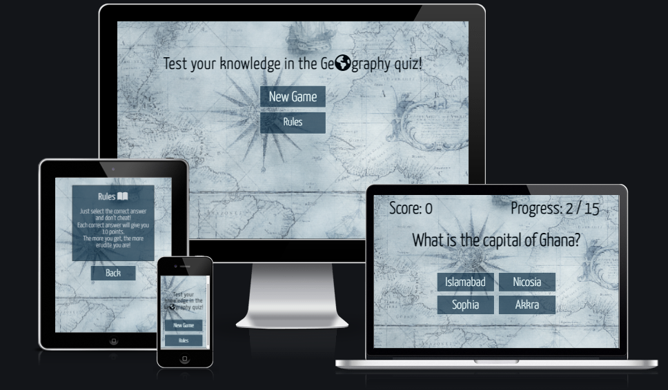
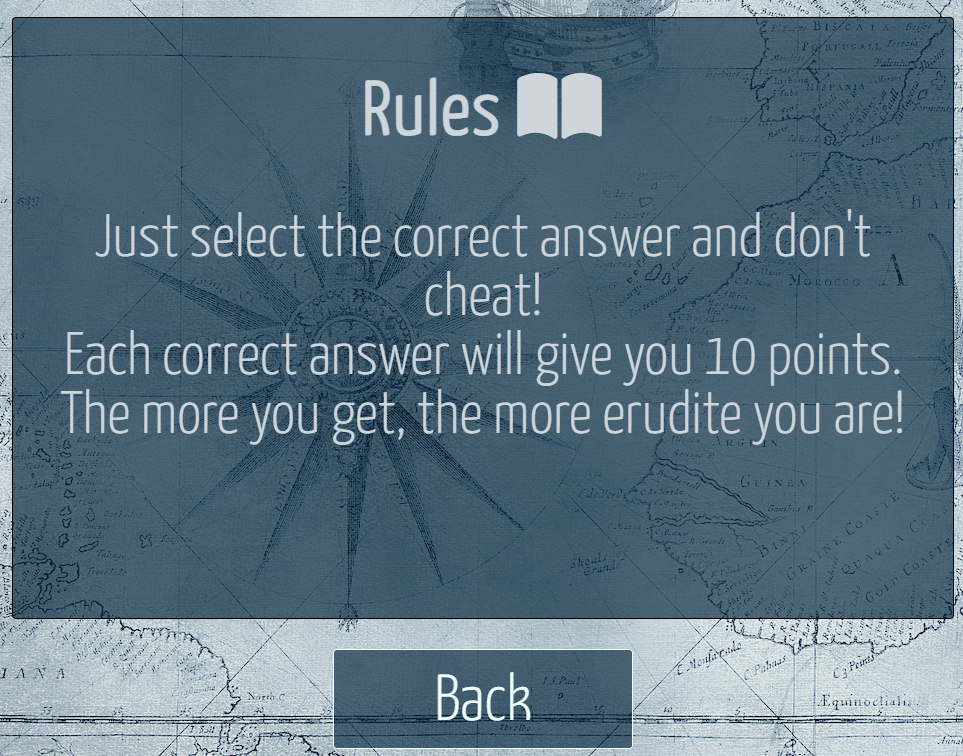
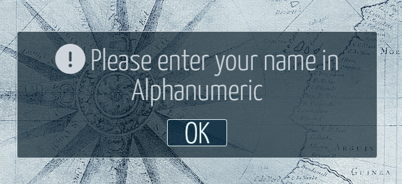
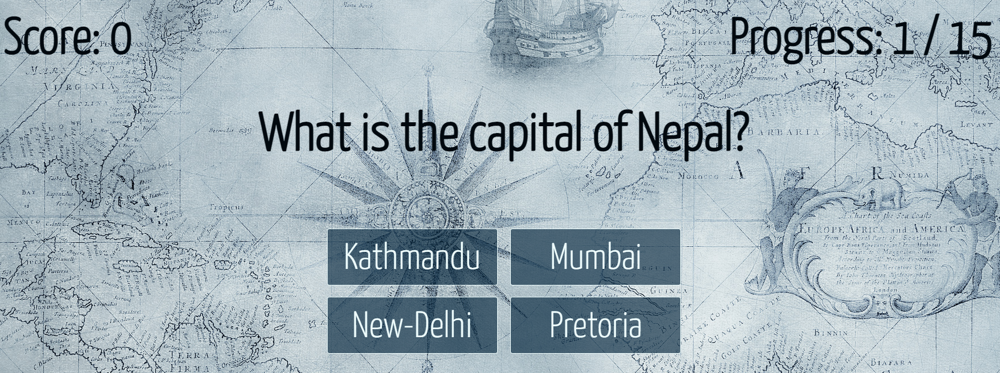
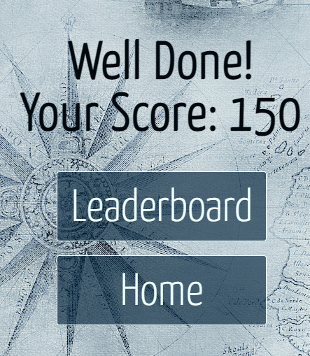

# Geography quiz

An interactive quiz that tests user's knowledge of countries and their capital cities. Contain 15 questions and randomly generated answers, with one correct answer respectively.

Leaderboard with username and score is available by the end of quiz.

<a href="https://folkor1.github.io/JavaScriptProject/quiz.html" target="_blank">Geography quiz website link</a>

## Features

The website is designed so the new quizes and complexity levels can be added and perfectly fit into the website's design.

### Existing features

- __Navigation Menu__

  - The navigation menu consists of two options: start a new game and preview the rules.

     

- __Rules__

   - Rules page with general terms of the quiz.

   

- __New Game__

   - Brings the user to name input screen.

 - __Name Input__

    - Allows to enter user's name in Alphanumeric format that will be visible on the leaderboard by the end of quiz.

    

- __Invalidation Message__

   - Invalidation message pops up if the name entered is not in Alphanumeric format.

   

- __Quiz Game__

   - Quiz game that consists of 15 questions.
   - Score bar that increments by 10 with every correct answer chosen.
   - Randomly generated answers where the correct answer always displayed.

   

- __Endgame Menu__

   - Allows the user to preview Leaderboard or return to the main page.
   - Allows the user to see the final score.

   

- __Leaderboard__

  - Shows the username and score.

  

  ### Features to implement

   - Randomization of the quiz questions.
   - Make wrong answers non-repeatable.
   - Multiple entries to the leaderboard.
   - Use of Enter key to submit input on the name input page.
   - Highlight a button with green color when the correct answer is picked, and with red when incorrect answer is picked respectively.
   - Small timeout before changing the question once an answer was picked.

## Testing

Testing was performed on all stages of the project, with the final one after deployment.

  - Tested all navigation buttons to make sure they are leading to the correct directories and there are no broken ones.

  - All quiz question were tested to make sure there is always correct answer showing.

  - Tested the maximum and 0 score to make sure there are no errors.

  - Tested long user name to ensure that it fits into the leaderboard without overflow.

  - Tested scaling from 1600px to 320px screens to make sure there are no overflows.

Bugs identified during the testing:

  - Input page elements appeared to be misaligned after pressing 'OK' on the error message window.
    
    - Fixed by changing the display type from 'block' to 'initial' in the function that calls these elements.

  - Two similar incorrect answers in a single questions round.
   
    - Fixed by adding a function that loopes through the incorrect answers list until it finds a unique one.

  - Only incorrect answers were pulled to all four options.

    - Identified an issue in the function and fixed.

  - Long user's name was overflowing the score on the leaderboard when using smaller screen.

    - Fixed by adding a word-wrap property.

## Validator testing

 - HTML
    - No errors identified in <a href="https://validator.w3.org/" target="_blank">W3C HTML validator</a>

- CSS
   - No errors identified in <a href="https://jigsaw.w3.org/css-validator/#validate_by_uri" target="_blank">W3C CSS validator</a>

- JavaScript
   - No errors identified in <a href="https://beautifytools.com/javascript-validator.php" target="_blank">BeautifyTools</a>

## Deployment

The project was deployed to GitHub by following these steps:

 1. Login to GitHub
 2. Select the repository
 3. Navigate to 'Settings' -> 'Pages'
 4. In the 'Source' drop-down menu select 'main'
 5. Press 'Save'
 6. The link becomes available straight away and the project loads once the building process is finished

 ## Credits

 Background image was taken from <a href="https://pixabay.com/" target="_blank">Pixabay</a>

 The icons were taken from <a href="https://fontawesome.com/" target="_blank">Font Awesome</a>

 Font was taken from <a href="https://fonts.google.com/" target="_blank">Google Fonts</a>

 The following resources were used for solutions and ideas:

 - <a href="https://www.w3schools.com/" target="_blank">W3Schools</a>

 - <a href="https://stackoverflow.com/" target="_blank">Stack Overflow</a>